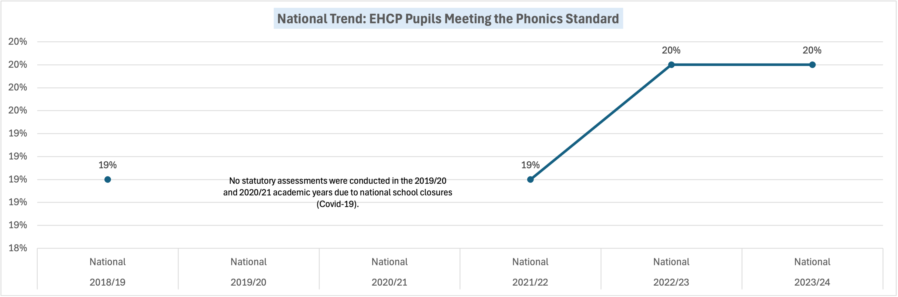

# EHCP Phonics Attainment Gap Analysis – Medway vs National (2018/19–2023/24)

## Overview

This project evaluates phonics screening attainment outcomes for pupils with an Education, Health and Care Plan (EHCP) in Medway, benchmarking performance against national EHCP averages.

The analysis highlights a persistent attainment gap, high disapplication rates, and structural performance risks requiring strategic intervention.

---

## Objectives

- Analyse EHCP phonics attainment trends (2018/19–2023/24)
- Benchmark Medway performance against national EHCP averages
- Quantify attainment gaps and recovery trajectory
- Identify structural risks and system-level weaknesses
- Propose evidence-based strategic recommendations

---

## Data Source

- Department for Education – Explore Education Statistics
- Phonics Screening Check (Year 1)
- Time period: 2018/19 to 2023/24  
  *(No national assessments were conducted in 2019/20 and 2020/21 due to school closures.)*

Data was cleaned, validated, and aggregated using Excel to enable year-on-year comparison and benchmark calculations.

---

## Key Findings

### 1️⃣ Persistent Attainment Gap

- National EHCP attainment remained stable at ~19–20%
- Medway attainment fell to 3% in 2021/22
- 2023/24: Medway = 9% vs National = 20%
- Medway remains less than half the national benchmark

This indicates sustained underperformance relative to peers.

---

### 2️⃣ Fragile Recovery Pattern

- Post-pandemic recovery in Medway shows improvement from 3% → 12% → 9%
- Gains are inconsistent and not yet embedded
- National trend demonstrates stronger stability

---

### 3️⃣ System Efficiency Risk

- EHCP cohort increased significantly over the period
- Number meeting the standard declined relative to cohort growth
- Increased support has not translated into proportional outcome gains

---

## Visual Outputs

### EHCP Attainment – Medway vs National

---

### National EHCP Trend (Benchmark Stability)

national_ehcp_trend.png

---

## Strategic Risk Assessment

The data suggests:

- Structural inconsistency in phonics intervention delivery
- Excessive reliance on disapplication
- Lack of embedded, resilient system performance
- Risk of widening educational inequality

---

## Recommended Strategic Response

A four-pillar intervention framework:

1. Standardised evidence-based phonics programme adoption  
2. SEND-specialist teacher training and coaching  
3. Termly EHCP-specific progress monitoring  
4. Disapplication audit and reduction strategy  

---

## Technical Approach

- Data cleaning and transformation in Excel  
- Year-on-year percentage calculations  
- Benchmark comparison (Medway vs National)  
- Gap quantification and trend analysis  
- Cohort efficiency assessment  

---

## Application

This analysis supports:

- SEND strategy development  
- Resource allocation decisions  
- Performance improvement planning  
- Education policy evaluation  

---

## Full Report

Board-ready presentation available:

[View Full Report](reports/EHCP_Medway_Phonics_Analysis.pdf)
